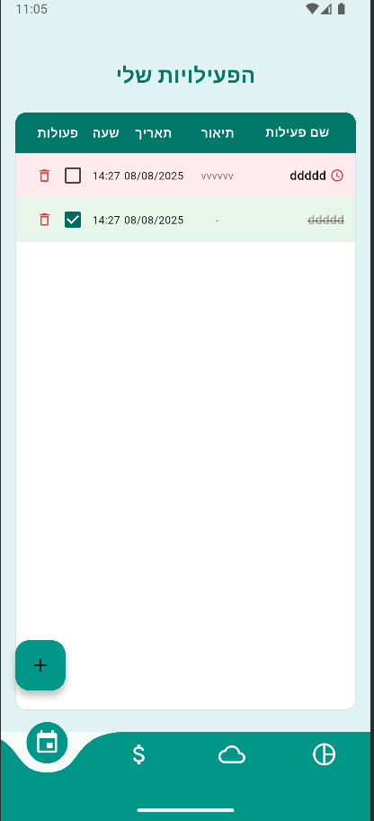
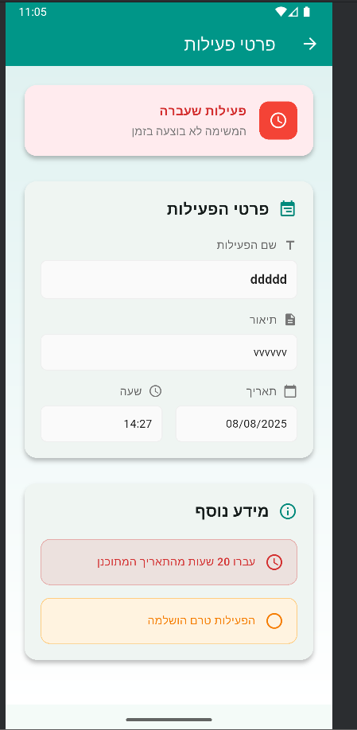
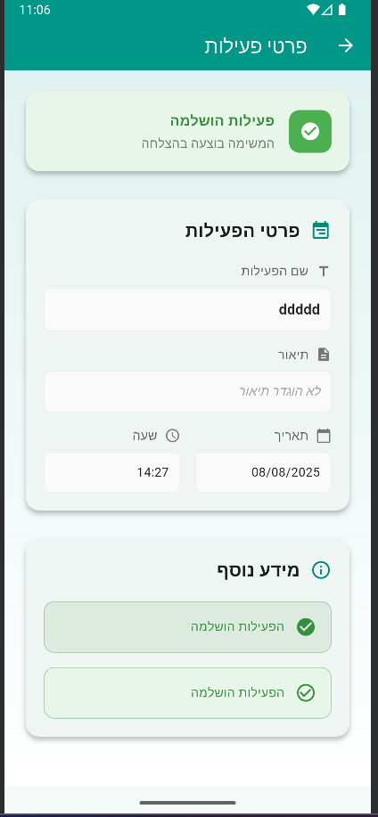
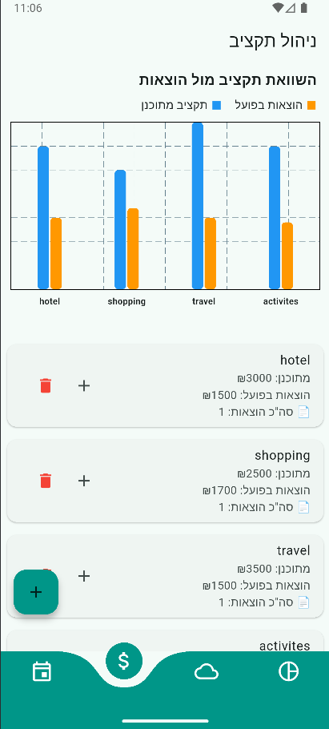
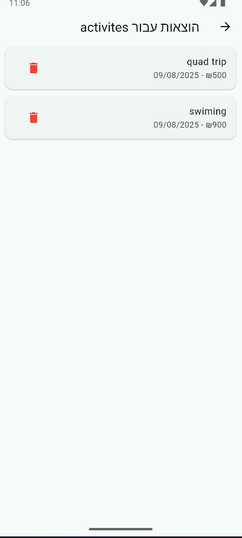
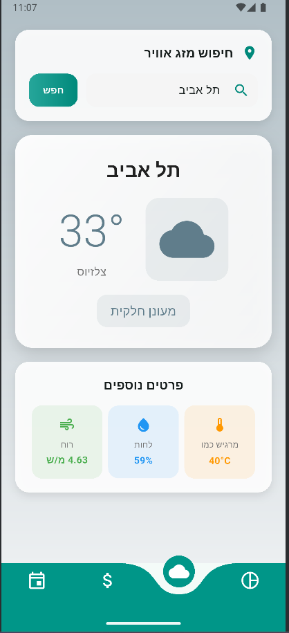
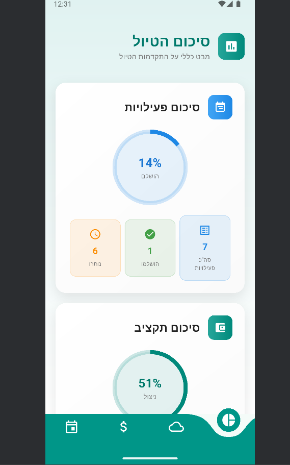
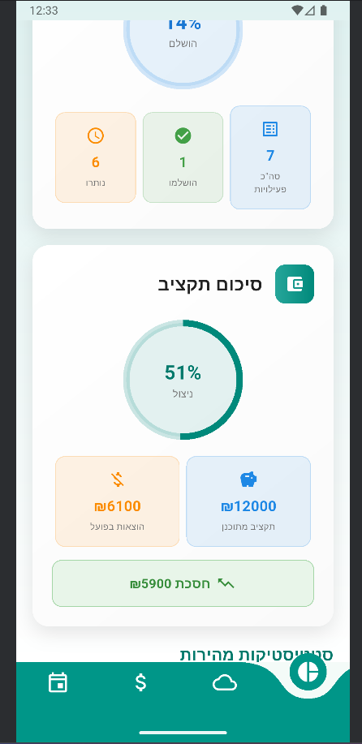
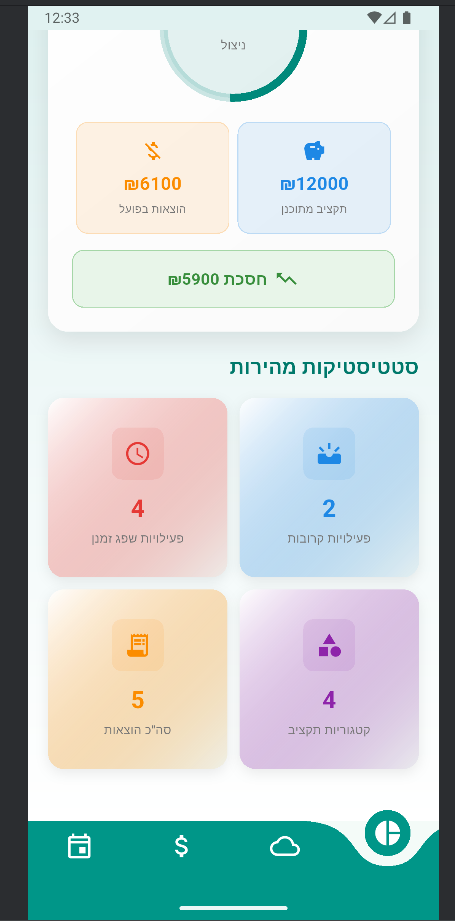

# andriod_app_mytrip

##MyTrip App


Introduction
The MyTrip app is designed for planning, managing, and tracking a trip or vacation in Israel and abroad. It includes
screens for managing activities, budgeting, weather tracking, and trip summary

```bash
Main technologies:

-Flutter

-Android Studio

-Open weather Api

Flutter SDK
```

##Activties_page 








##budget_page






##Weather_page




##summary_page





